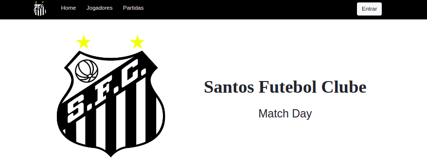

# Santos FC Match Day

MVC app build in [Yesod](https://github.com/yesodweb/yesod) - [Haskell](https://www.haskell.org/>)


Special Topics project from [Analysis and Systems Development](https://fatecrl.edu.br/cursos/analise-e-desenvolvimento-de-sistemas) -  [FATEC Baixada Santista](https://fatecrl.edu.br/)

------------------

## Project URL

[https://matchdayfcsantos.herokuapp.com/](https://matchdayfcsantos.herokuapp.com/)



## Pre requirements

[Install Yesod We Framework](https://www.yesodweb.com/page/quickstart)

## Run the project

```sh
stack build
```

and then

```sh
stack exec matchdayfcsantos
```
### MVP Features

* Create user profile
* List all players
* Create, read, uodate and delete a player
* List all matchs
* Create, read, uodate and delete a match

## Future Release

* 0.0.1
    * Add player image
* 0.0.2
    * Add user permissions 
    * Add level permissions


## Contributing

1. Fork it (<https://github.com/stephanogiuseppe/bd-haskell-yesod>)
2. Create your feature branch (`git checkout -b feature/fooBar`)
3. Commit your changes (`git commit -am 'Add some fooBar'`)
4. Push to the branch (`git push origin feature/fooBar`)
5. Create a new Pull Request
